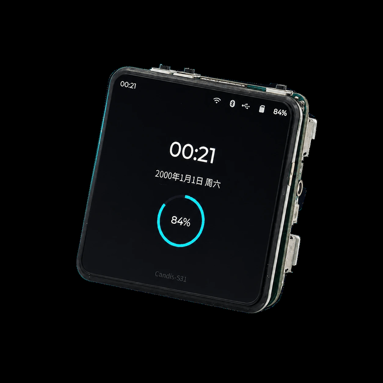
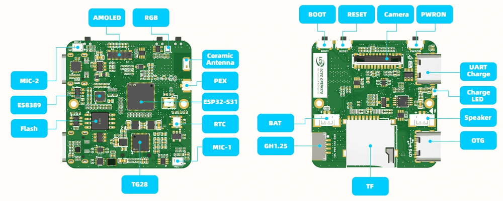
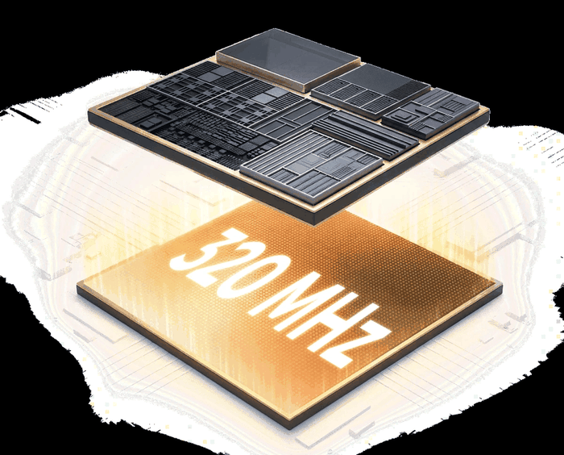
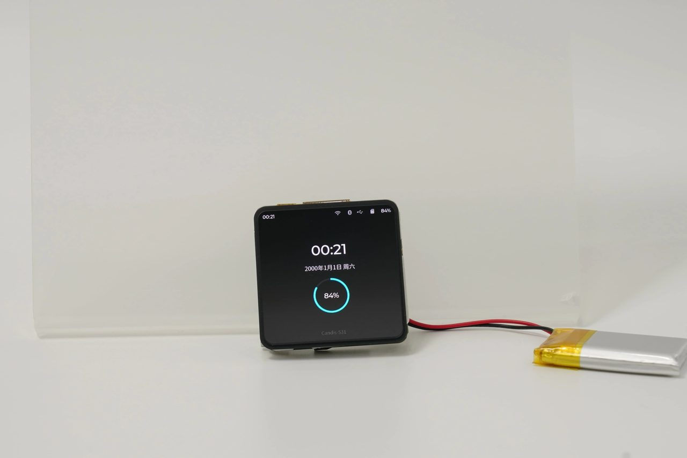
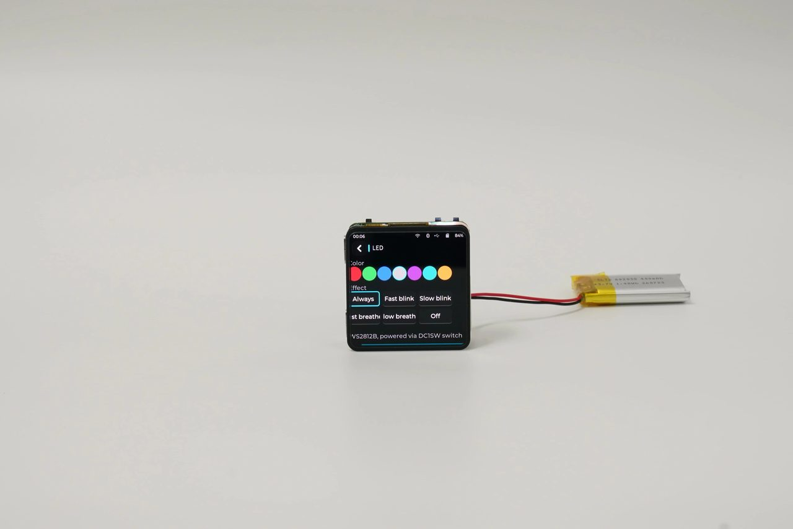

# Candis-S31

[简体中文](README_ZH.md)

Candis-S31 is an open reference design for the ESP32-S31, built around a 2.0-inch 460 x 460 square AMOLED.
It integrates touch, audio, a DVP camera connector, a TF card slot, two USB Type-C ports and TG28 power
management on a single board, providing a reusable hardware and firmware baseline for ESP32-S31 products.



**2.0" AMOLED (460 x 460) · Dual-core RISC-V · 16 MB / 32 MB PSRAM**

## Hardware at a glance

The board carries the complete interactive set: AMOLED display and touch, audio input and output, a DVP
camera interface, two USB Type-C ports, a TF card slot, power management and an RTC.



| | Block | Description |
|---|---|---|
| 01 | **ESP32-S31** | Dual-core RISC-V, targeting graphics, multimedia and wireless interaction |
| 02 | **CO5300 AMOLED** | 2.0-inch square panel, 460 x 460, QSPI interface |
| 03 | **CST820** | On-board capacitive touch controller, completing the display interaction path |
| 04 | **TG28 PMIC** | Multiple power rails, battery charging and RTC supply |
| 05 | **ES8389** | Audio codec, dual analog microphones and a speaker amplifier |
| 06 | **Dual Type-C** | Separate debug interface and native USB OTG interface |

## ESP32-S31 platform

The primary controller is the Espressif ESP32-S31, which combines multi-protocol connectivity with
advanced HMI capabilities.



| | |
|---|---|
| **320 MHz** | Dual-core high-performance 32-bit RISC-V main processor |
| **16 MB / 32 MB** | In-package Octal PSRAM, providing space for graphics resources |
| **16 MB** | On-board W25Q128 QSPI flash |
| **PPA** | JPEG codec and 2D DMA graphics hardware |
| **Wi-Fi 6** | 2.4 GHz wireless LAN connectivity |
| **Multi-protocol** | Bluetooth 5.4 and IEEE 802.15.4 |

## Power and interfaces

| | Interface | Description |
|---|---|---|
| C1 | Debug Type-C | CH343P USB-to-serial bridge: download, serial console and power input |
| C2 | USB OTG | Native ESP32-S31 USB with FUSB303B role control and ISL9113 5 V boost |
| PWR | TG28 PMIC | Multiple DCDC/LDO rails, battery charging, power on/off control and RTC supply |
| RTC | RX8130CE | Standalone real-time clock with an integrated crystal |
| I²C | EXT header | GH1.25-4 carrying GND, switched 3.3 V and an independent I²C bus |
| RGB | Buttons and light | PWRON, BOOT and RESET buttons plus one WS2812 RGB LED |

## Specifications

| Item | Detail |
|---|---|
| Main processor | ESP32-S31 dual-core 32-bit RISC-V, up to 320 MHz |
| Low-power coprocessor | Single-core 32-bit RISC-V, up to 40 MHz |
| On-chip memory | 512 KB SRAM |
| PSRAM | 16 MB / 32 MB in-package Octal PSRAM |
| Flash | 16 MB W25Q128 QSPI flash, 3.3 V |
| Wireless | 2.4 GHz Wi-Fi 6, Bluetooth 5.4, IEEE 802.15.4 |
| Display | 2.0-inch 460 x 460 AMOLED, CO5300 QSPI controller |
| Touch | CST820 capacitive touch controller |
| Audio | ES8389 codec, dual analog microphones, NS4150B differential speaker amplifier |
| Camera | 24-pin FPC, 8-bit DVP data interface |
| Storage | TF / microSD slot on the SDMMC bus with a switched supply |
| USB Type-C 1 | CH343P USB-to-serial: download, console and power input |
| USB Type-C 2 | Native USB OTG with FUSB303B Type-C control and ISL9113 5 V boost |
| Power management | TG28 PMIC: DCDC/LDO rails, battery charging, soft power on/off and VRTC |
| Real-time clock | RX8130CE with an integrated 32.768 kHz crystal |
| Expansion | GH1.25-4: GND, switched 3.3 V, I²C SDA, I²C SCL |
| Other resources | PWRON / BOOT / RESET buttons, WS2812B-1313-V6 RGB LED |
| Hardware revision | v0.5-Beta1 / EVT1 |

> **Notes**
> The board ships without a battery or an enclosure. USB Type-C 2 is limited to 5 V / 500 mA when used as
> a power output; the switched 3.3 V supply on the EXT header is limited to 300 mA. A camera module must
> match the 24-pin FPC pinout. The speaker output is differential — neither side may be grounded.
>
> The flash supply (VDD_SPI) is 3.3 V on this board because the external W25Q128 is a 3.3 V part; R6 holds
> GPIO36 high at reset accordingly. Keep R6 fitted.

## Gallery






## Getting started

The repository root is not a build project. Each example is a standalone ESP-IDF project:

```bash
cd examples/esp-idf/getting-started
idf.py --preview set-target esp32s31
idf.py --preview build
idf.py --preview -p PORT flash monitor
```

The validated baseline is ESP-IDF `v6.1-rc1`. Espressif Installation Manager (EIM), the official VS Code
extension and the command line all drive the same project; read the
[example guide](examples/esp-idf/getting-started/README.md) before building.

`tools/build-all.sh` compiles the whole matrix serially, which is the recommended first check after a
clone:

```bash
tools/build-all.sh --list      # targets and their source directories
tools/build-all.sh             # build every target
```

## Examples

| Example | Purpose |
|---|---|
| [`getting-started`](examples/esp-idf/getting-started) | Toolchain and target smoke test |
| [`display-hello`](examples/esp-idf/display-hello) | AMOLED bring-up through the declarative Board Manager path |
| [`display-touch`](examples/esp-idf/display-touch) | AMOLED cross marker with live touch coordinates |
| [`display-benchmark`](examples/esp-idf/display-benchmark) | Full-screen and partial refresh frame rates |
| [`camera-test`](examples/esp-idf/camera-test) | OV5640 DVP capture with a live 460 x 460 AMOLED preview |
| [`player`](examples/esp-idf/player) | TF-card audio and video player on the ESP-GMF pipeline |
| [`audio-recorder`](examples/esp-idf/audio-recorder) | Microphone capture to a WAV file on the TF card |
| [`audio-player`](examples/esp-idf/audio-player) | Sine tone generation and WAV playback |
| [`storage`](examples/esp-idf/storage) | TF card mount and file read/write check |
| [`usb-host-msc`](examples/esp-idf/usb-host-msc) | Type-C2 host mode mounting a USB mass-storage device |
| [`usb-cdc-device`](examples/esp-idf/usb-cdc-device) | Type-C2 native USB CDC device console |
| [`led`](examples/esp-idf/led) | WS2812B RGB LED effects |
| [`buttons`](examples/esp-idf/buttons) | BOOT and PWR button events |
| [`rtc`](examples/esp-idf/rtc) | RX8130CE time keeping and alarms |
| [`pmic`](examples/esp-idf/pmic) | TG28 rail dump and speaker amplifier control |
| [`power-cycle`](examples/esp-idf/power-cycle) | Board power state and battery domain helper |
| [`low-power`](examples/esp-idf/low-power) | Light sleep, deep sleep and screen-off state machine |
| [`wifi`](examples/esp-idf/wifi) | Wi-Fi station scan and connection |
| [`ble`](examples/esp-idf/ble) | NimBLE advertising and scanning |
| [`factory`](firmware/factory) | Board bring-up console used for production checks |

## Repository layout

```text
.
├── hardware/                  # Schematic, pinout and board notes
├── docs/                      # System overview
├── cmake/                     # Shared standalone-project wiring
├── components/
│   ├── candis_s31/            # Board runtime component (pins, power, display, audio, camera)
│   └── esp_lvgl_port/         # Board-local LVGL port
├── examples/esp-idf/          # Standalone example projects
├── firmware/
│   ├── factory/               # Factory console and release contract
│   └── recovery/              # Recovery procedure
├── tools/                     # Build matrix and release scripts
├── vendor/
│   ├── esp-board-manager/     # Board Manager and friends-board snapshot
│   └── idf-extra-components/  # Local reusable-driver snapshot
└── .github/workflows/         # Build verification
```

Every standalone project builds from its own directory; the repository root intentionally has no
top-level application `CMakeLists.txt`.

## Documentation

- [System overview](docs/system-overview.md)
- [Hardware overview](hardware/README.md)
- [Schematic](hardware/schematic/SCH_Schematic_3_2026-08-10.pdf)
- [Pinout](hardware/pinout/README.md)
- [Board runtime component](components/candis_s31/README.md) and its [API reference](components/candis_s31/API.md)
- [Factory firmware](firmware/factory/README.md)
- [Recovery procedure](firmware/recovery/README.md)
- [Upstream ownership and contribution map](UPSTREAM.md)

## Toolchain

The repository targets the ESP-IDF `v6.1-rc1` preview target `esp32s31`. The board runtime component, the
declarative Board Manager definition and every example build from a plain clone with no extra environment
variables. See [QUICKSTART.md](QUICKSTART.md) for the environment and flashing steps.

## Board support

- The Candis-S31 runtime component lives in [`components/candis_s31/`](components/candis_s31) and owns the
  board pins, power sequencing, Type-C policy, camera clock setup and the AMOLED/LVGL path. No ESP-BSP
  checkout is required.
- The reusable TG28_SW, RX8130CE, FUSB303B and CST820 drivers are mirrored in
  [`vendor/idf-extra-components/`](vendor/idf-extra-components), and the declarative board description in
  [`vendor/esp-board-manager/esp_friends_boards/`](vendor/esp-board-manager/esp_friends_boards).
  [`display-hello`](examples/esp-idf/display-hello) uses that Board Manager definition directly.
- Board Manager describes device and peripheral wiring; the board's shared-interrupt, charging, Type-C,
  camera-clock and display-transition policy lives in the runtime component. Advanced firmware therefore
  uses the component, while the small display example uses the Board Manager path.
- Driver ownership and the upstream contribution map are recorded in [UPSTREAM.md](UPSTREAM.md).

## License

Source code is licensed under Apache-2.0 unless a file states otherwise. Hardware documents remain subject
to the notices included with those files.
